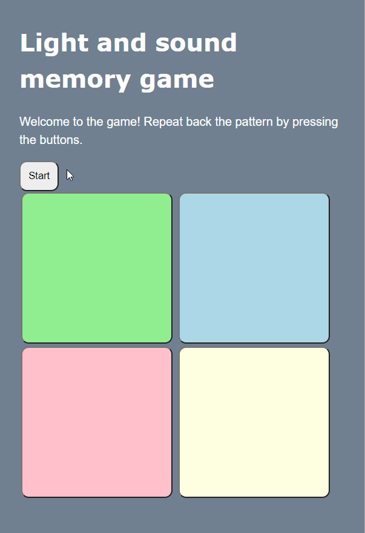

# Pre-work - *Memory Game*

**Memory Game** is a Light & Sound Memory game to apply for CodePath's SITE Program. 

Submitted by: **NAME**

Time spent: **7** hours spent in total

Link to project: https://light-sound-memory-game-1.glitch.me

## Required Functionality

The following **required** functionality is complete:

* [x] Game interface has a heading (h1 tag), a line of body text (p tag), and four buttons that match the demo app
* [x] "Start" button toggles between "Start" and "Stop" when clicked. 
* [x] Game buttons each light up and play a sound when clicked. 
* [x] Computer plays back sequence of clues including sound and visual cue for each button
* [x] Play progresses to the next turn (the user gets the next step in the pattern) after a correct guess. 
* [x] User wins the game after guessing a complete pattern
* [x] User loses the game after an incorrect guess

The following **optional** features are implemented:

* [ ] Any HTML page elements (including game buttons) has been styled differently than in the tutorial
* [ ] Buttons use a pitch (frequency) other than the ones in the tutorial
* [ ] More than 4 functional game buttons
* [ ] Playback speeds up on each turn
* [ ] Computer picks a different pattern each time the game is played
* [ ] Player only loses after 3 mistakes (instead of on the first mistake)
* [ ] Game button appearance change goes beyond color (e.g. add an image)
* [ ] Game button sound is more complex than a single tone (e.g. an audio file, a chord, a sequence of multiple tones)
* [ ] User has a limited amount of time to enter their guess on each turn

The following **additional** features are implemented:

- [ ] List anything else that you can get done to improve the app!

## Video Walkthrough (GIF)

## Reflection Questions
1. If you used any outside resources to help complete your submission (websites, books, people, etc) list them here.  

[
I checked the definitions of some keywords on W3Schools/Google when I got confused, but I did not keep track of what in particular.
One thing I remember is checking how to make my CSS show up on a GitHub pages site. (GitHub pages works perfectly well to host this game).
I found some help on StackOverflow. Though this GitHub pages effort was not part of the prework requirements, so maybe it isn't relevant here.
]

2. What was a challenge you encountered in creating this submission (be specific)? How did you overcome it? (recommended 200 - 400 words) 

[
My primary challenge was finding one of my typos. I had typed everything by hand, to better understand each word/line of code.
The problem at hand was that, during the clue-sequence playback, my buttons "made sound" but did not light up. I actually didn't realize this was a problem at first. It required me to use my auditory memory to remember the pattern, which I enjoyed doing. I later remembered that I wrote code to make the buttons light up without explicitly clicking on them. I didn't test after writing that code, because I had yet to write the clue-sequence code. If I could go back, I would have written a small snippet of code just to ensure the proper functionality. 

As for how I overcame it, I thought about where I am trying to make my button light up; what functions are called (playClueSequence, playSingleClue, lightButton).
Eventually I was led to lightButton, where I scanned for anything out of place. Everything looked fine initially, but I realized I spelled Id as ID:
document.getElementBy**ID**("button" + btn).classList.remove("lit");
instead of
document.getElementBy**Id**("button" + btn).classList.remove("lit");
and that I used the same function body as my clearButton function:

document.getElementById("button" + btn).classList.**remove**("lit");
instead of 
document.getElementById("button" + btn).classList.**add**("lit");

I made the fixes and everything worked as intended
]

3. What questions about web development do you have after completing your submission? (recommended 100 - 300 words) 

[
I know nearly anything I can imagine is probably possible through web development, so I don't have many questions right now about possibility (a few though). My questions are more centered on how things are done. For example, I have gotten curiousity about how Twitch.tv implements their live streaming service; how netflix blocks screenshots. One thing I am really wondering is how much information can websites get from your behavior. Can they detect **if (not what)** audio is playing on your computer or browser? How do they know when you switch tabs. Can cookies track your keystrokes? How can I setup a payment system? How do I make a login system secure? How do I connect a database and website?

Some of these questions are old, but have "rearisen" through this assignment.

I think I'll have a lot more questions as I keep learning more advanced web development. There's a **lot** to cover.
]

4. If you had a few more hours to work on this project, what would you spend them doing (for example: refactoring certain functions, adding additional features, etc). Be specific. (recommended 100 - 300 words) 
[
I would go and really understand the AudioContext library. I skimmed through this provided https://www.the-art-of-web.com/javascript/creating-sounds/ link,
but came across a **lot** of unfamiliar things.

I did not pick apart the AudioContext code written for the game, so I only got a very general idea of audio playback.
I like sound, so I want to understand this library, and to do that, I need to understand the smaller parts of what was in that tutorial link.
Ex. gainNode, audioCtx, filterNode, prototypes, etc.

I also would get more familiar with classes in javascript. I saw the word "this" a lot, but it has been some time since I worked with C++, the last place where I also saw the "this" keyword.
]

## Interview Recording URL Link

[My 5-minute Interview Recording](your-link-here)

## License

    Copyright [YOUR NAME]

    Licensed under the Apache License, Version 2.0 (the "License");
    you may not use this file except in compliance with the License.
    You may obtain a copy of the License at

        http://www.apache.org/licenses/LICENSE-2.0

    Unless required by applicable law or agreed to in writing, software
    distributed under the License is distributed on an "AS IS" BASIS,
    WITHOUT WARRANTIES OR CONDITIONS OF ANY KIND, either express or implied.
    See the License for the specific language governing permissions and
    limitations under the License.
